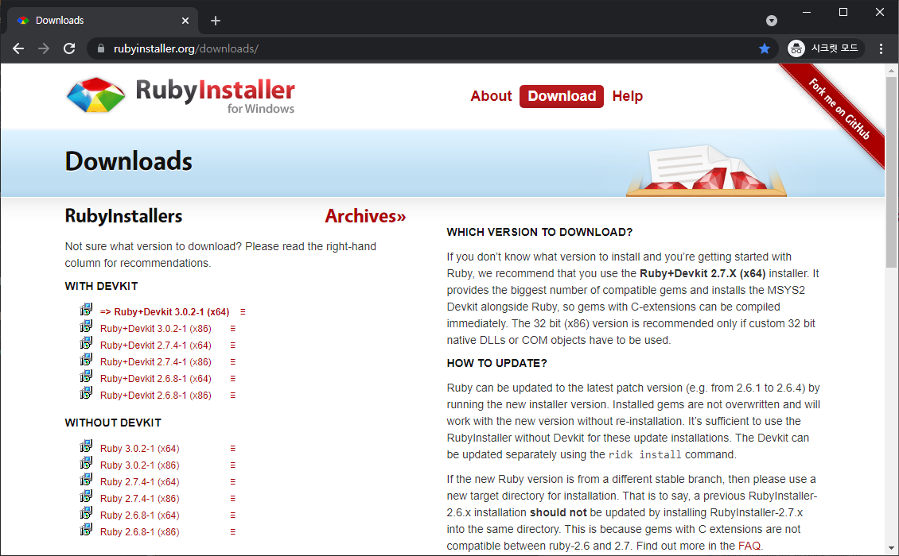
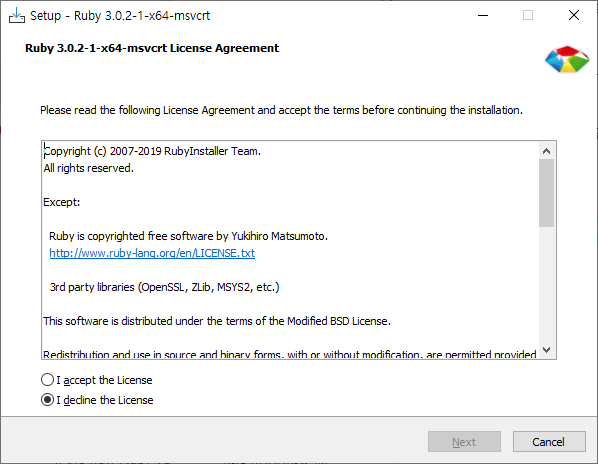
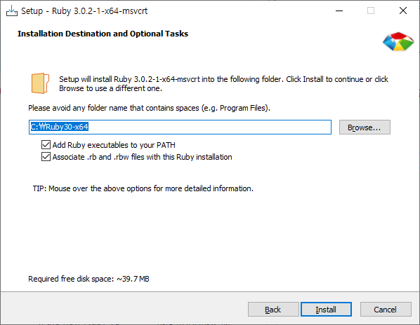
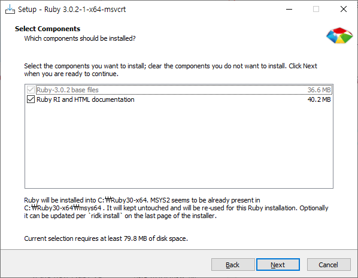
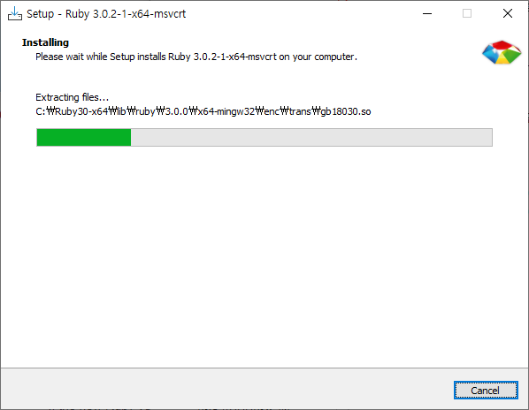
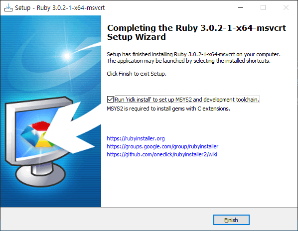
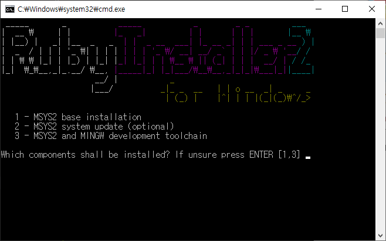

:toc:

= README

== 환경설정

이 책은 ``asciidoc``형식의 텍스트 파일로 만들어졌고, ``asciidoctor``를 사용해서 책을 만듭니다. ``Asciidoctor``를 사용하려면 ruby를 설치해야합니다.

=== ruby 설치하기

2가지만 기억하세요.

1. Devkit이 포함된 ruby 설치하기
2. 마지막 검은색 명령창에서 ``1 + 엔터``, ``2 + 엔터``, ``3 + 엔터``

link:https://rubyinstaller.org/downloads/[루비 공식 홈페이지](link:https://rubyinstaller.org/downloads/[])에서  `rubyinstaller-devkit-3.0.2-1-x64.exe`를 다운로드해서 설치합니다.

마지막 검은색 명령창이 떴을 때가 가장 중요합니다. 반드시 ``1 엔터``, ``2 엔터``, ``3 엔터`` 를 순서대로 입력해서 모두 설치해야 합니다.

=== git 설치하기

이미 git이 설치되어 있겠지만.

git을 설치하는 이유는 git-bash를 사용하기 때문입니다.

link:https://git-scm.com/[Git 공식 홈페이지(https://git-scm.com/)]에서 다운로드해서 설치해 줍시다.

=== make 설치하기

make도 설치해야 합니다. 이건 choco를 사용해서 설치합시다. choco를 설치하는 방법은 link:https://chocolatey.org/install[Chocolatey 공식 홈페이지(https://chocolatey.org/install)]를 참고하세요.

[source,powershell]
----
choco install make
----

=== asciidoctor관련 패키지 설치

asciidoctor관련 패키지를 설치합니다. 그리고 PDF에서 한글을 표현하기 위한 폰트도 다운로드 받습니다.

[source,bash]
----
bundle install
make font
----

== 책 생성하기

모든 형식의 책을 생성하려면 ``make``만 입력하세요.

[source,bash]
----
make
----

특정 형식의 책을 만들수도 있습니다.

[source,bash]
----
make html
make pdf
----

== 저장소를 처음 상태로 정리하기

저장소를 처음 상태로 정리하는 명령입니다.

[source,bash]
----
make clean
----

